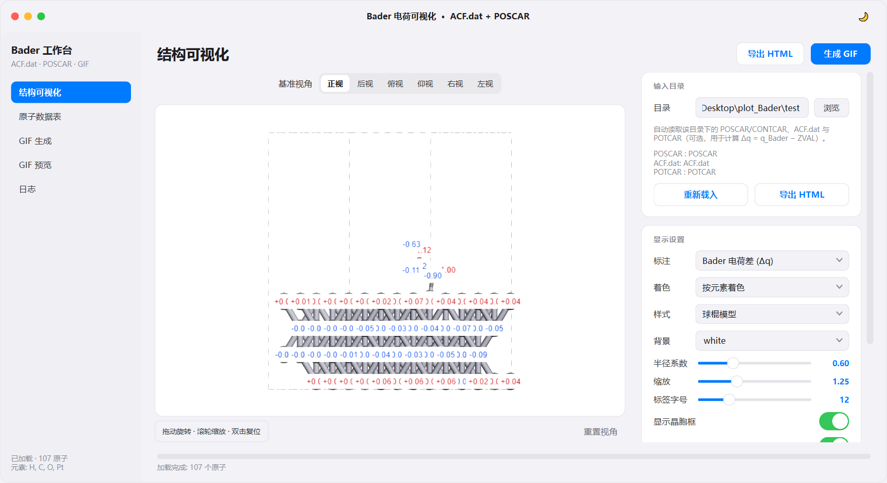
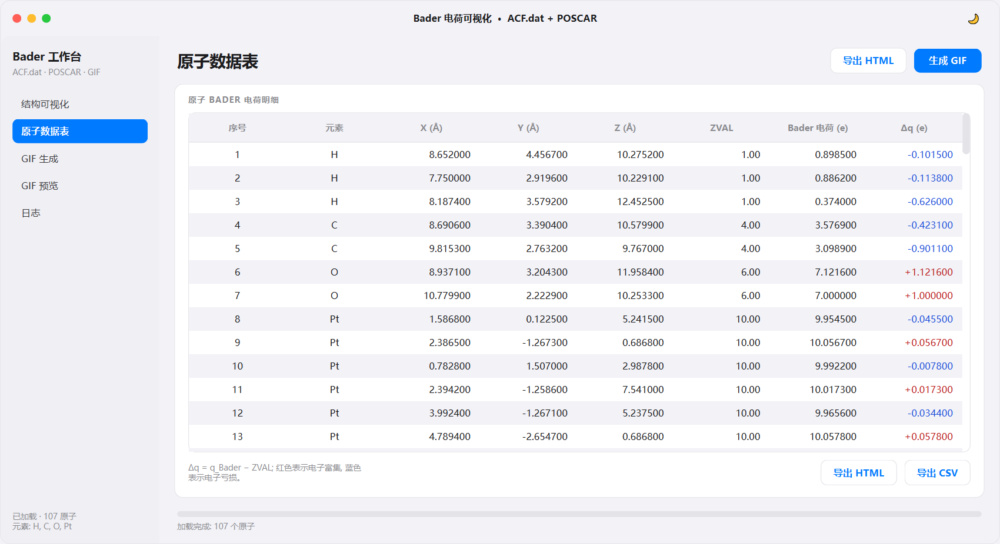
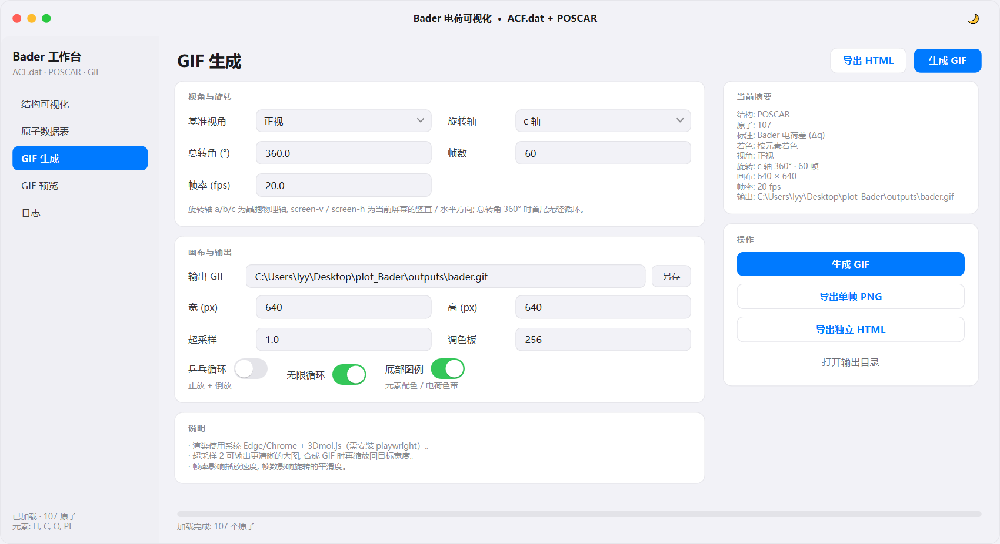
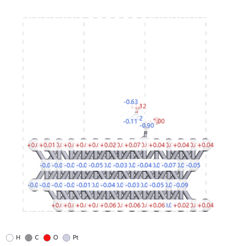
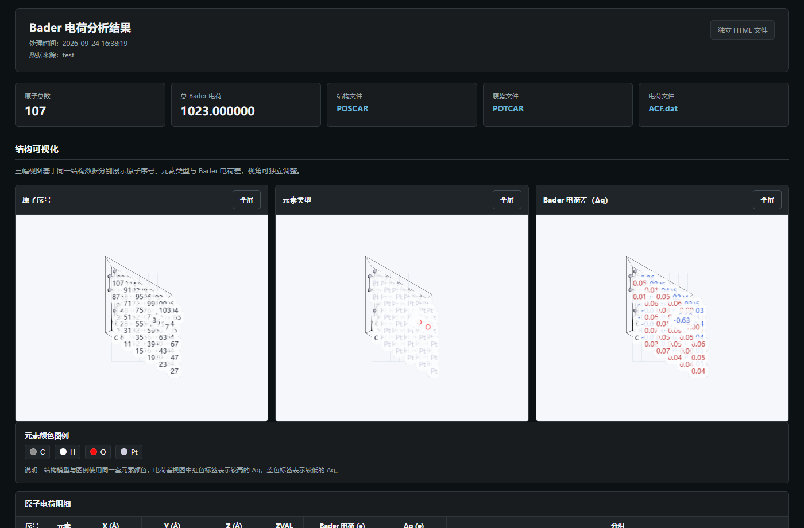

<div align="center">

# Bader 电荷可视化工作台

**ACF.dat + POSCAR → 交互式 3D 结构 · 旋转 GIF · 独立 HTML 报告**

把 VASP / Bader 的电荷分析结果，一键变成可交互、可预览、可分享的可视化成果。

[](https://github.com/moyulyy/plot-Bader/releases/latest)
[](https://github.com/moyulyy/plot-Bader/releases)
[](LICENSE)
[](https://github.com/moyulyy/plot-Bader/stargazers)


[功能一览](#-功能一览) · [界面预览](#-界面预览) · [下载使用](#-下载便携版) · [源码运行](#-快速开始源码) · [命令行](#-命令行) · [常见问题](#-常见问题)

</div>

---

## ⬇️ 下载（便携版）

无需安装 Python，**下载即用**：

<p align="center">
<a href="https://github.com/moyulyy/plot-Bader/releases/latest"><b>➡️ 前往 Releases 下载 BaderChargeViewer-*-win64-portable.zip</b></a>
</p>

1. 下载并解压 `BaderChargeViewer-<版本>-win64-portable.zip`；
2. 双击解压目录中的 **`BaderChargeViewer.exe`**；
3. 左侧选择包含 `POSCAR` / `CONTCAR`、`ACF.dat`（可选 `POTCAR`）的目录即可。

> 内置 `samples/` 示例数据可直接试用。生成 GIF 需要系统自带 **Edge（Win10/11 默认）** 或 Chrome。

---

## ✨ 功能一览

| 模块 | 能力 |
| --- | --- |
| 🧪 **解析** | 读取 `ACF.dat` + `POSCAR/CONTCAR`（可选 `POTCAR` 计算电荷差 `Δq = q_Bader − ZVAL`），按原子序号自动匹配 |
| 🧊 **交互 3D** | 内嵌 3Dmol.js：拖动旋转、滚轮缩放、双击复位，可显示晶胞框 |
| 🏷 **三种标注** | 原子序号 / 元素类型 / Bader 电荷差 `Δq` |
| 🎨 **两种着色** | 按元素（Jmol 配色）或按电荷差（蓝‑白‑红发散色带，以 0 为中心） |
| 🎞 **旋转 GIF** | 绕晶胞 `a/b/c` 轴或屏幕轴匀速旋转，正交相机取景，首尾无缝循环 |
| 📊 **数据表** | 逐原子明细（含 `ZVAL` / `Δq`），一键导出 CSV |
| 📄 **独立 HTML** | 导出与网页版一致的结果页（三视图 + 图例 + 明细 + 分组统计 + 判据说明），完全自包含 |
| 🖼 **单帧 PNG** | 快速导出一张静态结构图（含图例） |

---

## 🖼 界面预览

<div align="center">

**结构可视化** — 基准视角居中，交互查看，右侧实时调参



</div>

<div align="center">

<table>
<tr>
<td width="50%" align="center"><b>原子数据表</b><br></td>
<td width="50%" align="center"><b>GIF 生成</b><br></td>
</tr>
</table>

**旋转 GIF 效果**



**导出的独立 HTML 结果页**



</div>

---

## 🚀 快速开始（源码）

需要 Python 3.10+（推荐 3.11）。以 conda 环境为例：

```bat
:: 1) 安装依赖
pip install -r requirements.txt
:: 或者双击： install_deps.bat

:: 2) 启动图形界面（无控制台）
run_gui.bat
:: 等价于： python bader_gui.py

:: 3) 命令行生成示例
run_cli.bat
:: 等价于：
python bader_to_gif.py ^
  --poscar samples\POSCAR --acf samples\ACF.dat ^
  --out outputs\bader.gif --html outputs\bader.html
```

也可用内置示例数据快速体验：把输入目录设为 `samples/`。

---

## 📦 目录结构

```text
plot_Bader/
├─ bader_gui.py            # 图形界面主程序 (PySide6 + QWebEngineView)
├─ bader_core.py           # 解析 / 3Dmol HTML / 渲染 / GIF / 独立 HTML 核心
├─ bader_to_gif.py         # 命令行工具
├─ ui_kit.py               # iOS 风格 Qt 组件库
├─ make_icon.py            # 生成应用图标
├─ make_docs.py            # 生成 README 截图与示例产物
├─ build_exe.py            # 一键打包便携版 exe + zip
├─ BaderChargeViewer.spec  # PyInstaller 打包配置
├─ 3dmol/                  # 内嵌 3Dmol.js
├─ assets/                 # 图标 + 独立 HTML 资源 (bader.css / bader.js)
├─ samples/                # 示例数据 (POSCAR / CONTCAR / ACF.dat)
├─ docs/                   # README 截图
├─ outputs/                # 默认输出目录
├─ test/                   # 完整测试算例 (含 POTCAR / OUTCAR 等)
├─ run_gui.bat             # 启动 GUI（无控制台）
├─ run_gui_debug.bat       # 调试启动（保留控制台）
├─ run_cli.bat             # 命令行示例
├─ install_deps.bat        # 安装依赖
├─ requirements.txt
└─ LICENSE
```

---

## 🖥 图形界面

界面采用 iOS / macOS 风格，包含 5 个页面，右上角常驻 **「导出 HTML」「生成 GIF」** 按钮。

### 1. 结构可视化

- 顶部中央：**基准视角**（正视 / 后视 / 俯视 / 仰视 / 右视 / 左视），基于晶胞矢量计算；
- 左侧：交互 3D 视图（3Dmol.js，正交相机，旋转时物体大小恒定）；
- 右侧：
  - **输入目录** — 只需选一个目录，自动识别 `POSCAR/CONTCAR`、`ACF.dat`、`POTCAR`；
  - **显示设置** — 标注、着色、样式（球棍 / 空间填充 / 棍状 / 线框）、半径系数、缩放、标签字号、背景、晶胞框；
  - **统计** — 原子总数、总 Bader 电荷、`Δq` 范围、所用文件。

### 2. 原子数据表

逐原子列出 `序号 / 元素 / X / Y / Z / ZVAL / Bader 电荷 / Δq`，`Δq` 红蓝染色，可 **导出 CSV** 与 **导出 HTML**。

### 3. GIF 生成

双栏网格布局：

- 左：「视角与旋转」（视角、旋转轴、总转角、帧数、帧率）、「画布与输出」（输出路径、宽高、超采样、调色板、乒乓 / 循环 / 图例开关）、「说明」；
- 右：「当前摘要」与「操作」（**生成 GIF** / **导出单帧 PNG** / **导出独立 HTML** / 打开输出目录）。

### 4. GIF 预览

滚轮缩放、拖动平移、双击复位，像看图工具一样预览生成结果。

### 5. 日志

完整运行日志，便于排查渲染 / 浏览器问题。

---

## ⌨️ 命令行

```bat
python bader_to_gif.py [选项]
```

| 选项 | 说明 | 默认 |
| --- | --- | --- |
| `--poscar` / `--acf` / `--potcar` | 输入文件 | `POSCAR` / `ACF.dat` / 同目录自动查找 |
| `-o, --out` | 输出 GIF（`.png` 则输出单帧） | `outputs/bader.gif` |
| `--html` | 额外导出独立 HTML 结果页 | — |
| `--label` | `charge` / `element` / `index` / `none` | `charge` |
| `--color` | `element` / `charge` | `element` |
| `--style` | `ballstick` / `sphere` / `stick` / `line` | `ballstick` |
| `--view` | `front` / `back` / `top` / `bottom` / `right` / `left` | `front` |
| `--rot-axis` | `a` / `b` / `c` / `screen-v` / `screen-h` | `c` |
| `--rot-angle` | 整段旋转总角度（`360` 无缝循环） | `360` |
| `--frames` / `--fps` | 帧数 / 帧率 | `60` / `20` |
| `-w, --width` / `--height` / `--scale` | 分辨率与超采样 | `640` / 同宽 / `1.0` |
| `--pingpong` / `--loop` | 乒乓循环 / 循环次数（`0` 无限，`-1` 不循环） | — / `0` |
| `--no-labels` / `--no-cell` / `--no-legend` | 关闭标签 / 晶胞框 / 底部图例 | — |

---

## 📄 导出独立 HTML

与 `work-list-0809` 项目 `/bader` 结果页一致，导出**自带内联 CSS、3Dmol.js 与 bader.js、
不依赖任何外部资源**的独立 HTML，可直接双击打开或分享：

<div align="center"></div>

内容包含：

- **三幅 3D 视图**：原子序号 / 元素类型 / Bader 电荷差；
- 元素颜色图例；
- **原子电荷明细表**（含 A–F 分组勾选框）；
- **分组统计**：按索引 / 按元素 / 按 Z 阈值；
- **Bader 电荷定义与判据**：基本定义、方法背景、经验判据表、可靠性自检、局限性与使用建议。

导出方式：GUI 右上角 / 数据表底部 / GIF 页「操作」卡片，或命令行 `--html outputs\bader.html`。

---

## 🔬 数据约定与判据

- 结构坐标取 **`ACF.dat`** 的笛卡尔坐标（与网页版一致），`POSCAR` 提供晶胞矢量与元素；
- `Δq = q_Bader − ZVAL`：`Δq > 0` 表示电子富集（红），`Δq < 0` 表示电子亏损（蓝）；
- 未提供 / 无法解析 `POTCAR` 时，自动降级显示原始 Bader 电荷 `q_Bader`。

| \|Δq\| (e) | 常见解读 |
| --- | --- |
| ≲ 0.1 | 近似中性，电子转移很弱 |
| 0.1 – 0.5 | 轻度电子转移（极性共价 / 配位） |
| 0.5 – 1.5 | 显著电子转移，离子性明显 |
| > 1.5 | 强离子性，需结合体系与方法复核 |

> Δq 反映价电子重新分布，**不等同于形式氧化态**；金属性 / 离域体系宜比较相对趋势。

---

## 📦 打包为 exe

```bat
python build_exe.py
```

产物：

```text
dist/BaderChargeViewer/BaderChargeViewer.exe          # 便携版程序
dist/BaderChargeViewer-1.0.0-win64-portable.zip       # 可分发的压缩包
```

打包配置见 `BaderChargeViewer.spec`：内嵌 3Dmol.js、`assets/`、`samples/` 与 Playwright
（浏览器内核不打包，运行时调用系统 Edge / Chrome）。GIF 渲染无需额外安装。

---

## 🛠 依赖与环境

| 组件 | 用途 |
| --- | --- |
| `numpy` | 数值与几何计算 |
| `pillow` | GIF 合成 / 图例绘制 / 图标 |
| `PySide6` | 图形界面（含 QtWebEngine） |
| `playwright` | 调用系统浏览器逐帧渲染（GIF / PNG） |
| `pyinstaller` | （可选）打包便携版 exe |

GIF 渲染需要 Chromium 内核浏览器：**Win10/11 自带 Edge** 即可；若都没有，可执行
`python -m playwright install chromium`。

应用图标由 `make_icon.py` 生成到 `assets/app.ico`；README 截图由 `make_docs.py` 生成。

---

## ❓ 常见问题

<details>
<summary><b>3D 视图底部有细线？</b></summary>

已从三方面彻底处理：

- **窗口层**：主窗口改为**不透明无边框窗口**（去掉 `WA_TranslucentBackground`），
  并让内容铺满整个窗口，从根本上避免 QWebEngine 未绘制像素透出桌面（深色桌面/窗口会显示为黑线）；
- **页面层**：`#v canvas` 设为 `display:block`，`#v` 与 canvas 显式设置背景色，
  底部加 2px 同色覆盖条并隐藏滚动条；
- **控件层**：显式设置 `QWebEngineView` 页面背景色，承载卡片使用 `WA_StyledBackground`。
</details>

<details>
<summary><b>GIF 生成很慢 / 失败？</b></summary>

耗时由「帧数 × 分辨率」决定，可先减小帧数、宽高或超采样做测试；失败时查看「日志」页，
通常是找不到浏览器，可安装 Edge/Chrome 或执行 `playwright install chromium`。
</details>

<details>
<summary><b>没有 POTCAR 可以吗？</b></summary>

可以。程序会自动在同目录查找 `POTCAR`；找不到时显示原始 Bader 电荷，不计算 `Δq`。
出于版权原因，仓库/发行包**不附带 POTCAR**。
</details>

<details>
<summary><b>支持 Linux / macOS 吗？</b></summary>

核心逻辑跨平台（PySide6 + 3Dmol.js），当前发行包仅提供 Windows x64。
</details>

---

## 📜 License

本项目基于 [MIT License](LICENSE) 开源。

<div align="center">

**参考实现**：`work-list-0809` 项目 `/bader` 页面（处理逻辑）· `CONT-gif` 项目（本地 GUI 与 GIF 渲染）

如果这个项目对你有帮助，欢迎 ⭐ Star 支持一下～

</div>
